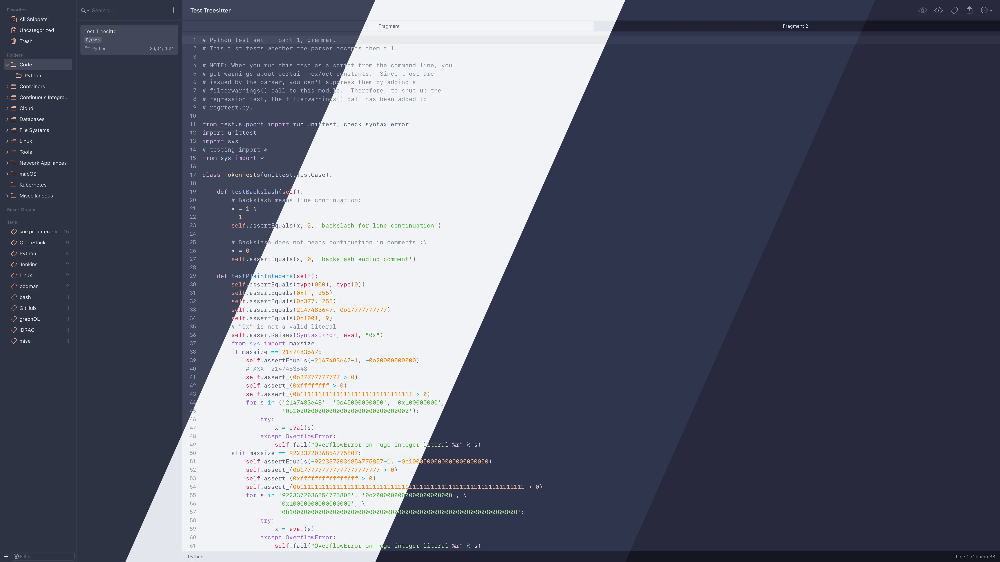
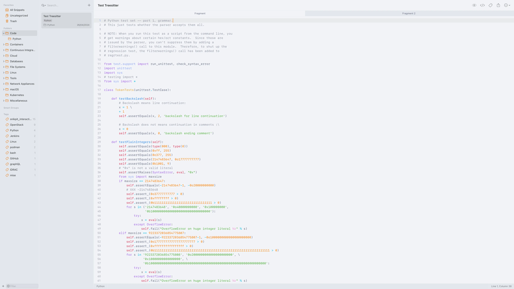
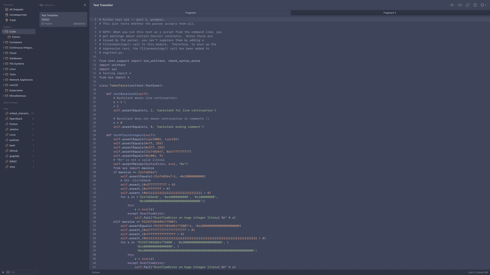
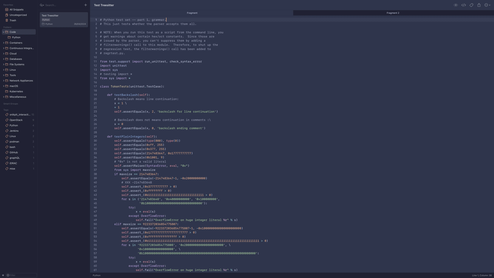
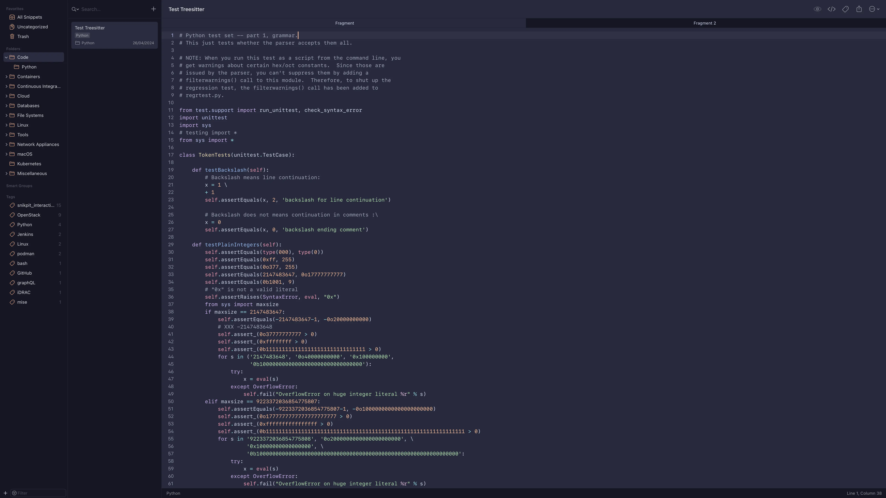

<h3 align="center">
	<br/>
	
	Catppuccin for <a href="https://www.renfei.org/snippets-lab/">SnippetsLab</a>
	
</h3>

<p align="center">
	<a href="https://github.com/vkhitrin/snippetslab-catpuccin/stargazers"></a>
	<a href="https://github.com/vkhitrin/snippetslab-catpuccin/issues"></a>
	<a href="https://github.com/vkhitrin/snippetslab-catpuccin/contributors"></a>
</p>

<p align="center">
	
</p>

> [!IMPORTANT]
> Currently colors are more vivid than intended.
> Refer to Neovide's similar [issue](https://github.com/neovide/neovide/issues/1102).

> [!NOTE]
> Syntax color is inspired by TreeSitter and is still a work in progress.

## Previews

<details>
<summary>🌻 Latte</summary>

</details>
<details>
<summary>🪴 Frappé</summary>

</details>
<details>
<summary>🌺 Macchiato</summary>

</details>
<details>
<summary>🌿 Mocha</summary>

</details>

## Adding The Themes

1. Download the themes:

```bash
wget -P "/tmp/" https://github.com/vkhitrin/snippetslab-catpuccin/raw/main/catppuccin-latte.json
wget -P "/tmp/" https://github.com/vkhitrin/snippetslab-catpuccin/raw/main/catppuccin-frappe.json
wget -P "/tmp/" https://github.com/vkhitrin/snippetslab-catpuccin/raw/main/catppuccin-macchiato.json
wget -P "/tmp/" https://github.com/vkhitrin/snippetslab-catpuccin/raw/main/catppuccin-mocha.json
```

2. Import themes:  
   `Preferences -> Theme -> Import Theme...`
